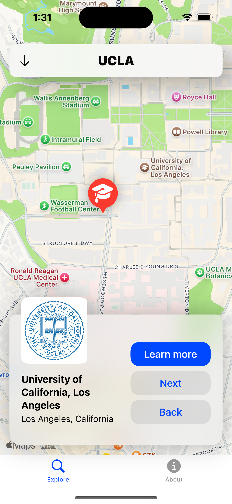
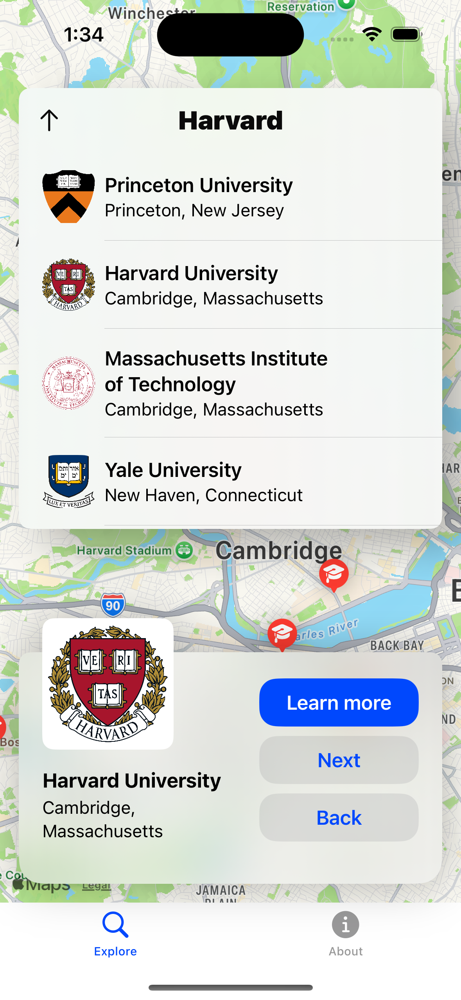

# Spot my College 

**A comprehensive iOS app to help with the college research process.**

> **Note:** *I built and shipped this app in 2022 while learning Swift. It was previously live on the App Store with 1,000+ downloads.*

<p align="center">
  
  
  
  <br>
  <em>Explore Campuses • View Deep-Dive Stats • Seamless Search</em>
</p>

## About
Finding the right college is often a chaotic process of juggling stats, application info, locations, tuition, and campus vibes. **Spot my College** was built to centralize this data into a mobile-first experience, acting as a lens to top US universities. 

The app provided students with a visual and data-driven way to explore potential schools, combining hard stats (acceptance rates, SAT ranges) with soft factors (campus imagery, local environment).

## Key Features
* **Interactive Campus Maps:** Users can locate universities on a map and zoom in to see specific dorms, lecture halls, libraries, and nearby amenities (restaurants, stores, parks) to gauge the campus lifestyle.
* **Deep-Dive Metrics:** Detailed views for each institution, including:
    * Acceptance Rates & SAT/ACT score ranges.
    * Most popular majors and overall school ratings.
    * Tuition and Fees
    * School history and descriptions.
* **Visual Discovery:** curated imagery of famous campus buildings and landmarks.
* **Application Integration:** Direct links to school application portals.

## Tech Stack
* **Language:** Swift 
* **Frameworks:** UIKit, MapKit, CoreLocation
* **IDE:** Xcode

## How to Run
1.  Clone the repository:
    ```bash
    git clone [https://github.com/jishk11/Spot-my-College.git](https://github.com/jishk11/Spot-my-College.git)
    ```
2.  Open the project file in Xcode (Note: The project file is named `College Lists` internally):
    ```bash
    open "College Lists.xcodeproj"
    ```
3.  Select a simulator (e.g., iPhone 16 Pro) and press **Run (Cmd+R)**.
